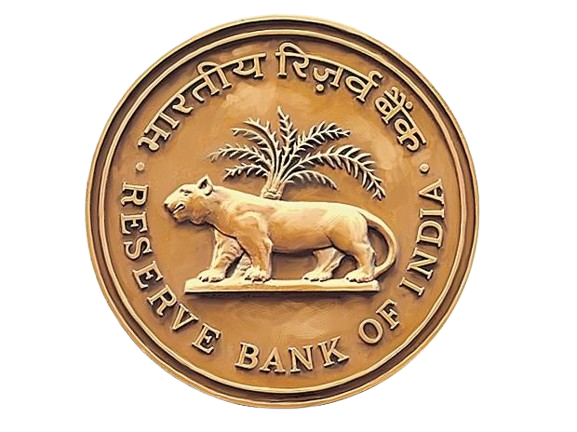
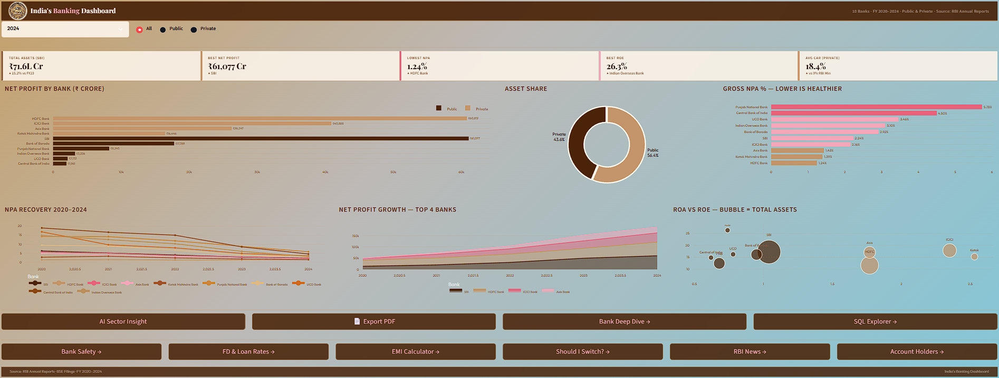

#  India's Banking Dashboard

<div align="center">



[](https://india-banking-dashboard.streamlit.app)


**A comprehensive financial analytics dashboard comparing 10 Indian banks across FY 2020–2024**

[🚀 Live Demo](https://india-banking-dashboard.streamlit.app) · [📊 Data Sources](#data-sources) · [🛠️ Tech Stack](#tech-stack)

</div>

---

## 📌 Overview

India's Banking Dashboard is a data analytics project built to visualize and compare the financial performance of **10 major Indian banks** — both public and private — across **5 fiscal years (FY 2020–2024)**.

It tells the story of **India's banking sector recovery** — bad loans falling, profits rising, and the gap between public and private sector banks.

---

## 🏛️ Banks Covered

| Public Sector | Private Sector |
|---|---|
| State Bank of India (SBI) | HDFC Bank |
| Punjab National Bank (PNB) | ICICI Bank |
| Bank of Baroda (BoB) | Axis Bank |
| UCO Bank | Kotak Mahindra Bank |
| Central Bank of India (CBI) | |
| Indian Overseas Bank (IOB) | |

---

## 📊 Key Metrics & Visualizations

### Page 1 — Overview Dashboard
- **5 KPI Cards** — Total Assets, Best Net Profit, Lowest NPA, Best ROE, Avg CAR
- **Net Profit by Bank** — Horizontal bar chart with Public/Private color coding
- **Asset Share** — Donut chart (Public vs Private)
- **Gross NPA %** — Conditional color bars (Green < 2% / Amber < 3.5% / Red > 3.5%)
- **ROA vs ROE Scatter** — Bubble size = Total Assets

### Trend Analysis
- NPA Recovery 2020–2024 — All 10 banks line chart
- Net Profit Growth — Top 4 banks area chart

### Features
- 🎛️ **Interactive Filters** — Year selector + Bank Type (All/Public/Private)
- 🤖 **AI Sector Insight** — Groq LLaMA powered analysis
- 📄 **PDF Export** — Download bank-wise report
- 🔍 **Bank Deep Dive** — Individual bank performance page

---

## 📖 Key Data Stories

```
📉 NPA Recovery    → All banks reduced bad loans from 2020 to 2024
💰 SBI 4x Growth   → Profit grew from ₹14,488 Cr to ₹61,077 Cr
🏆 ICICI Turnaround → NPA fell from 5.53% to 2.16%
🐘 SBI Dominance   → Larger than all 3 private banks combined
🌱 Small Bank Recovery → UCO, CBI, IOB recovering from RBI's PCA
```

---

## 🛠️ Tech Stack

| Layer | Technology |
|---|---|
| **Frontend** | Streamlit, Custom CSS |
| **Charts** | Plotly Express, Plotly Graph Objects |
| **Data** | Pandas, CSV (RBI Annual Reports) |
| **AI Insights** | Groq API (LLaMA 3.3 70B) |
| **PDF Export** | fpdf2 |
| **Deployment** | Streamlit Cloud |

---

## 📂 Data Sources

- **RBI Annual Reports** — Reserve Bank of India
- **BSE Filings** — Bombay Stock Exchange
- **Fiscal Years** — FY 2020 to FY 2024

> ⚠️ Data is curated from public sources for educational/portfolio purposes.

---

## 🎨 Design

- **Color Palette** — Cream (`#FDF6EC`) + Brown (`#4A2309`) + Pink (`#F4A7B9`)
- **Typography** — Playfair Display (headers) + Outfit (body)
- **Background** — Animated ₹ particle effect
- **Theme** — Warm, premium, RBI-inspired

---

## 👨‍💻 Author

**Ayush Raj**
BSc CSDA (Computer Science & Data Analytics)
IIT Patna | CPI 8.7

[](https://linkedin.com/in/ayush08iitp)
[](https://github.com/ayushcmd)
[](https://ayushcmd.github.io/portfolio-website)

---

<div align="center">

**⭐ Star this repo if you found it useful!**


</div>
